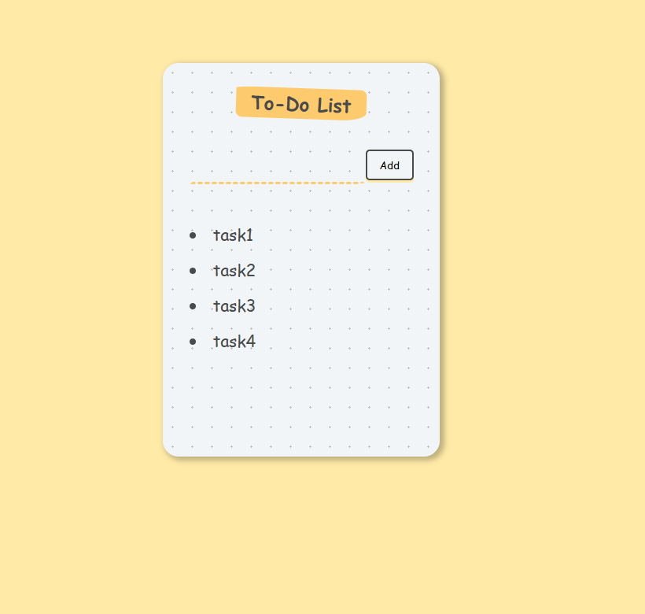

# To-Do List Web App

A simple yet modern **To-Do List** web application built with **React** and **Vite**.

Users can add tasks, remove tasks by clicking them, and their list persists in local storage.

---

## ✨ Features

✅ Add tasks via the **Add** button  
✅ Delete tasks by simply **clicking on them** in the list  
✅ Persistent data storage using browser localStorage  
✅ Built with React and Vite for lightning-fast performance

---

## 🖥️ Screenshot

Here’s how the app looks:




---


## 🛠️ Tech Stack

- React
- Vite
- HTML/CSS

---

## 📦 Installation

1. Clone the repository:

    ```bash
    git clone https://github.com/abhaymani421/ToDoListWebApp.git
    cd ToDoListWebApp
    ```

2. Install dependencies:

    ```bash
    npm install
    ```

3. Start the development server:

    ```bash
    npm run dev
    ```

Then open your browser and go to:  http://localhost:5173

